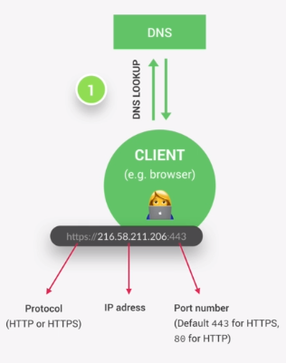
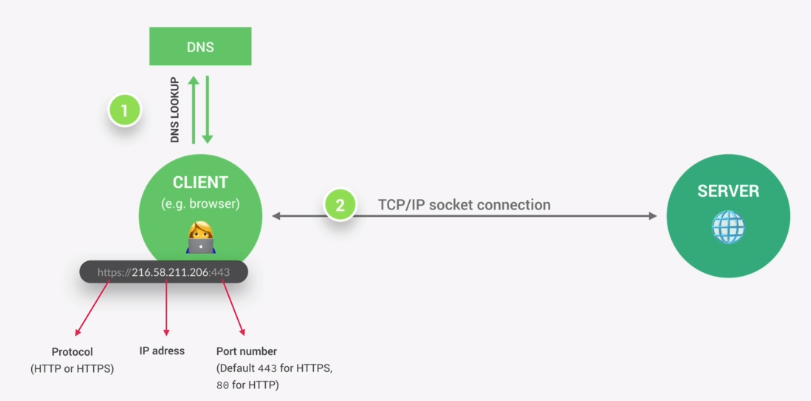
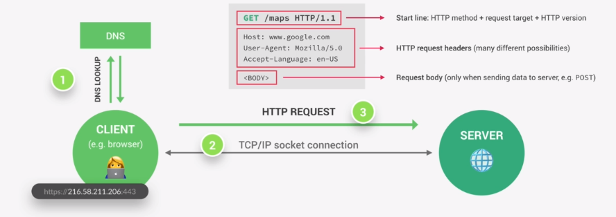
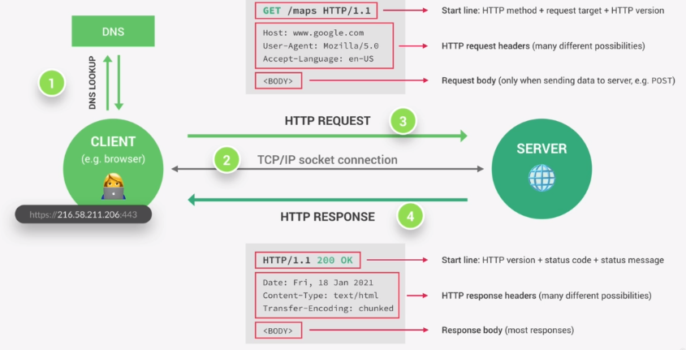

# How web works

When we go to some website the client makes a request and the server returns a response that contains the requested web page.

A domain name is converted into ip address before the connection to the server is made. This happens through the DNS which converts a domain name to IP address.

When we have a real IP address, a TCP/IP socket connection is established between browser and server. This connection is kept alive for the entire time it takes to transfer all the files necessary for displaying a web page.
TCP/IP are communcation protocol that define how the data travel across the web. They are internet's fundamental control system.

The job of TCP is to break the request and responses into thousands of small chunks before they are sent. Once they reach their destination they are reassembled. So the messages arrive at the destination quickly as possible which would not be possible if we send the request/response as one big chunk.

The job of the IP is to send and route all these packets through the internet. It makes sure they they arrive at the correct destination.

Now we make a HTTP request. HTTP is another communication protocol. A protocol is simply a rule that allow two parties to communicate. HTTP allows clients and server to communicate by sending requests to the server and sending respose back to the client by server.

Now The server processes the request and sends back a HTTP response. A developers are responsible for sending correct data that is contained in 'body'.
