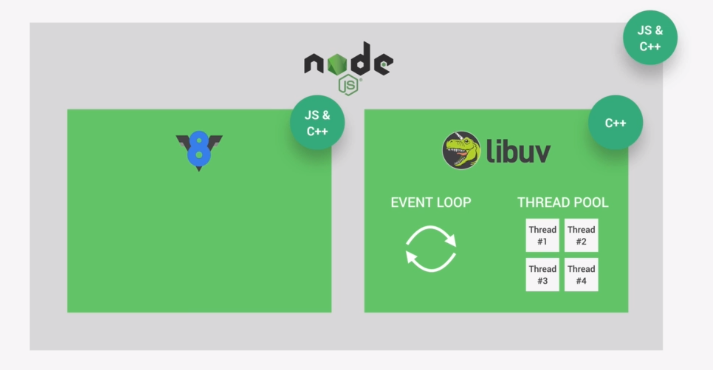
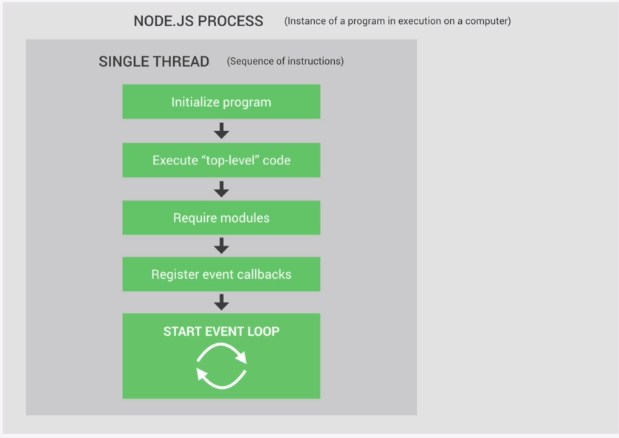
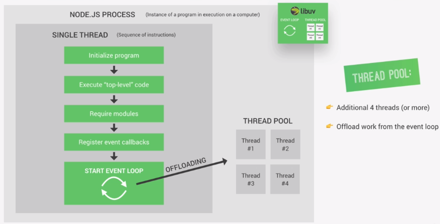
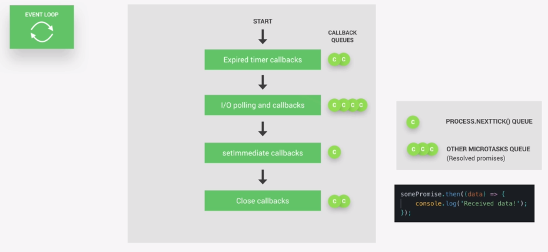
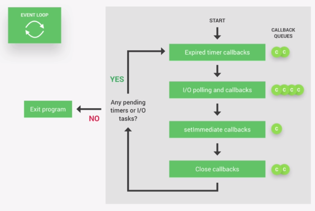
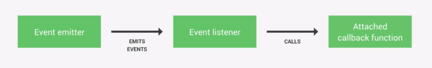
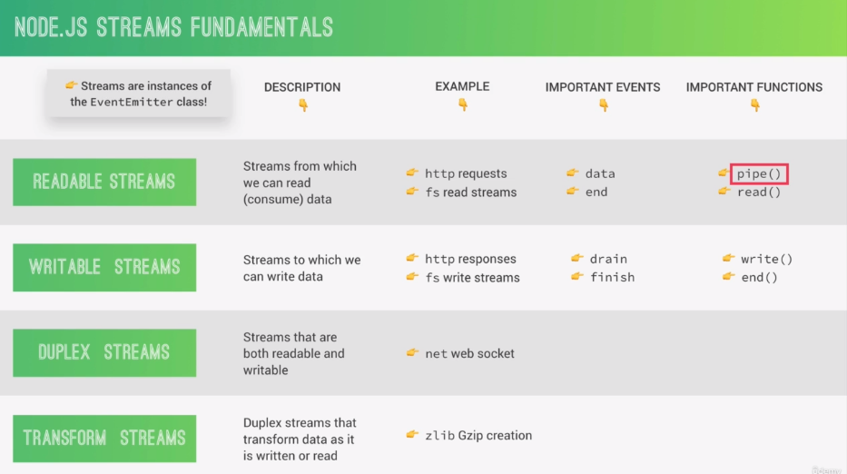

# How Node JS works: A Look Behind the scene

## NODE, V8, Libuv and C++

Let's start by learning about node architecture. Let's represent this architecture in terms of node's dependencies. These are the libraries that are required for the Node to work correctly.



The node.js runtime has two most important dependencies - V8 an libuv.
The V8 is what converts javascript code to machine code that a machine can understand. libuv is an open source library with a strong focus on asynchronous I/O. This layer gives node access to underlying operating system, filesystem and networking. Besides it also implements two important node js features which are **Event Loop** and **thread pool**.

The event loop is responsible for handling easy tasks like executing callbacks and network I/O while the thread pool is for more heavy works like file access or compression work.

The node js ties all these libraries and gives us access to their functions in pure javascript. It provides a layer of abstraction to make our life easier.

Some other libraries include -

- http-parser - for parsing http
- c-ares - for dns requests stuff
- openSSL - for cryptography
- zlib - for compression

## Processes, Threads and the Thread Pool

Whenever we use node on a computer that means there is a node process running on the computer. We already know that node js is a C++ process. In this process node js runs in a single thread. A thread is just a sequence of instruction, Imagine a thread as a box where our code is executed in computer's processor. Since node runs in a single thread, it makes it easy to block node applications. It doesn't matter if you have 10 user or 10 million users accessing your application at same time, the node runs in a single thread. So we need to very careful about not blocking that thread.

Let's what happens in a single thread when a program is run -



The event loop is where most of the work is done in the app.Some tasks are two heavy to be executed in the event loop because they would block single thread. That's where the Thread pool comes in, it is provided to node js by the libuv. This gives us four other threads that are completely separate from the single thread. We can configure up to use 128 threads but 4 are enough.



Event loop can offload heavy tasks to the thread pool. All this happens automatically behind the scene. A developer cannot decide what goes to the thread pool and what don't. The following tasks are handled in thread pool -

- File system APIs
- Cyrptography
- Compression
- DNS lookup

## The node js Event loop

The event loop is where all the application code that is inside callback function is executed. Some parts might get offloaded to the thread pool as we saw earlier.
The event loop is the heart of node architecture. Event loop is what makes asynchronus programming possible in Node js. Node js is build around callback functions, so function are called as soon as some work is finished. It works this way because node uses an **Event-driven architecture**: So task like http request or finished file reading process will emit events, event loop picks up these events and call the callback functions that are associated with each events.

**How does this all work behind the scene, in what order the callbacks are executed?**

When we start our node application the event loop starts running right away. The event loop has multiple phases and each phase has a callback queue which are the callbacks coming from the events that the event loop receives.
There are 4 important phase of event loop -



- The first phase takes care of callback of expired timers. These are the first one to be processed by the event loop. If the timer expires later during one of the other phases are being processed then callback of that timer will only be called as soon as the event loop comes back to this first phase. Callbacks of 4 phases are processed this way, callbacks of each queue are processed one by one untill there is no one is left in the queue, then only the event loop will enter next phase.
- The second phase processes the I/O polling and execution of I/O callbacks. The polling means looking for I/O events that are ready to be processed and putting them in callback queue. In the context of node js I/O simply means networking and file access. This is the phase where 99% of our code is executed.
- The third phase is for setimmediate callbacks. setimmediates are special kind of timer that we can use if we want to process callbacks immediately after the I/O polling and execution phase.
- The fourth phase is for close callbacks, these are not that important for us. In this phase all close events are processed for example when a web server or web socket shuts down.

Beside these queues there are 2 other queues which are -

- Process.nexttick() queue
- other microtasks queue (resolved promises)

After each phase if there are any callbacks in any of these two special queues, they will be executed right away.
Process.nexttick() is a function which we can use when we really need to execute certain callback right after the current event loop phase. It is similar to setimmediate with the difference that setimmediate will run only after the I/O phase.



When we go through all these phases we say we finished a one event loop tick. This tick is just one cycle in this loop. Now it's time to decide whether the loop should continue to the next tick or if the program should exit.
Now the node checks if there are any pending timers or I/O tasks running in background and if there are not any, then it will exit the application.

**Here is how not to block the single thread in which node js process runs** -

- Don't use sync version of functions in fs,crypto and zlib modules in your callback functions.
- Don't perform complex calculations in event loop ( e.g loop inside loop)
- be careful with JSON in large objects - It may take a very long time to parse or stringify Json.
- Don't use too complex regular expressions (e.g. nested quantifiers)

[Read More about Event Loop](https://nodejs.org/en/docs/guides/event-loop-timers-and-nexttick)

## The event-driven architecture

Most of the node js core module like http, filesystem and timers are all build around an event driven architecture. We can also use this architecture to our advantage in our own code.



In node there are certain objects like Event Emitter that emit named events as sonn as something important happens in our code. These events can be picked up by event listeners that developers setup which will fire callback functions.
This event emitter logic is called **observer pattern** in javascript. The idea is to setup an observer (listner) which keeps waiting/observing the subject that will emit the event that the listner is waiting for. The opposite of this pattern is functions calling other functions.

To create an object that emitts some event we use Event Emiiter class. It's a built in module of node js.

```js
const EventEmitter = require("events");

const myEmitter = new EventEmitter();

//setup a listner
myEmitter.on("newSale", () => {
  console.log("There was a new sale.");
});

//emit a named event
myEmitter.emit("newSale");
```

We can setup multiple listner for the same event. We can also pass arguments to the event listner by passing additional arguments to the `emit` method. In practise if we want to implement this pattern in our code then it is recommended that we create a new class that inherits from `EventEmitter` class. This is how modules like http & filesystem work by extending the EventEmitter class.

## Streams

Streams are another fundamental concepts in Node js.
With streams we can process (red and write) data piece by piece (chunks), Without completing the whole read or write operation, therefore we don't have to keep all the data in memory to do this operation. When we read files using streams, we read part of data, do something with it and then free the memory. we repeat this process until the entire file is processed.
Think of services like netflix and youtube, these stream videos using the same principle. So we don't need for the entire video file to load before we can watch it beacause data is received and processed in chunks. This concept of streams is universal to computer science in general. These characterstics make streams perfect for handling large volume of data like videos.

In node there are four fundamental type of streams -

- Readable streams
- Writable streams
- duplex streams
- transform streams

Readable and writable streams are most important.



**Streams in practice**
Let's say that we need to read a large text file and send it to the client. There are multiple ways we can do this -

```js
const fs = require("fs");
const server = require("http").createServer();

server.on("request", (req, res) => {
  fs.readFile("test-file.txt", (err, data) => {
    if (err) console.log(err);
    res.end(data);
  });
});

server.listen(8000, "127.0.0.1", () => {
  console.log("listening");
});
```

The problem with this solution is that node needs to read the entire file into memory then only it can send the data to the client.
This works fine for testing something during the development but using it in production is not going to work. If we receive tons of request this thing will crash.

Let's use streams to fix these issues -
we create a readable stream then as we receive each chunk of data we send it to the client as a response (writable stream).

```js
const fs = require("fs");
const server = require("http").createServer();

server.on("request", (req, res) => {
  const readable = fs.createReadStream("test-file.txt");

  // Each time there is new chunk of data that can be consumed
  //Redable stream emits 'data' event
  readable.on("data", (chunk) => {
    // response is writable stream
    //write data to writable stream
    res.write(chunk);
  });

  //handling when entire file is read
  //without this, this solution will not work
  readable.on("end", () => {
    res.end();
  });

  readable.on("error", (err) => {
    console.log(err);
    res.end("File not Found.");
  });
});

server.listen(8000, "127.0.0.1", () => {
  console.log("listening");
});
```

There is still a problem with this approach, our readble stream is much faster than actually sending the result with respone writable stream over the network. This will overwhelm the response stream which cannot handle all this incomming data so fast. This problem is called **Backpressure**. To fix this we can use the pipe operator. It is available on all readable streams and it allows us to pipe the output of a readable stream right into the input of a writable stream. This fixes the problem of backpressure because it will handle the speed of the data comming in and the speed of the data going out.

```js
const fs = require("fs");
const server = require("http").createServer();

server.on("request", (req, res) => {
  const readable = fs.createReadStream("test-file.txt");
  readable.pipe(res); // readableSource.pipe(writableDest)
});

server.listen(8000, "127.0.0.1", () => {
  console.log("listening");
});
```
