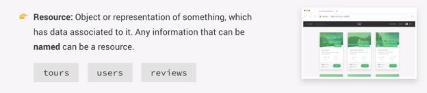
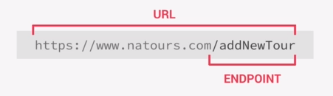
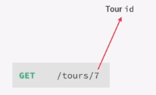
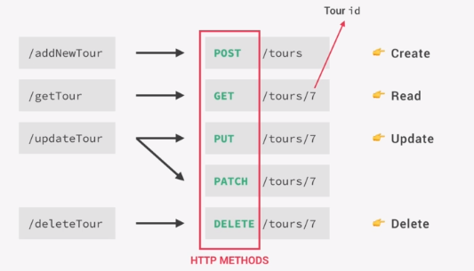
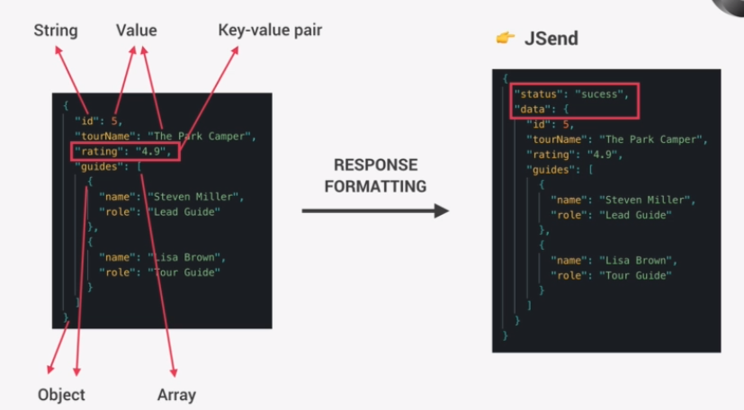
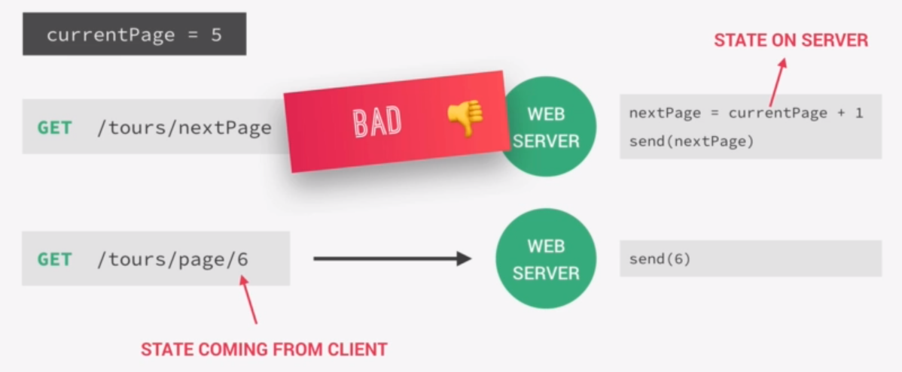
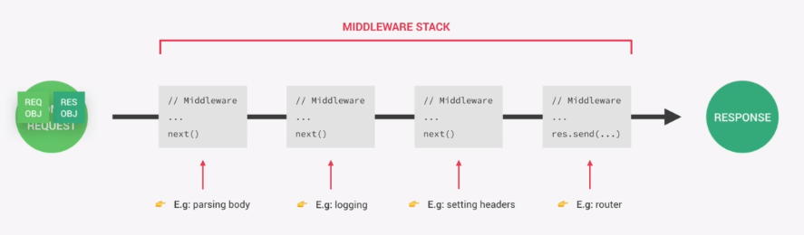

# Buliding API with express

## what is express

express is a minimal node js framework build on top of node js which provides high level of abstraction. Express contains a very robust set of features like complex routing, easier handling of requests and responses, adding middlewares, server-side rendering etc.

Express allows for rapid development of node js applications, It also makes it easier to organize our application into the MVC architecture.

## postman

[Postman](https://www.postman.com/) is a software for testing API which also aids in development of APIs.
It's kind of browser where we can enter an URL an make an request.

[Linux Installation](https://learning.postman.com/docs/getting-started/installation-and-updates/#installing-postman-on-linux)

## Installing express

Let's install express, create a simple server and do some basic routing.

```bash
npm i express
```

Create a new file called app.js where we save configuration for entire app. It's a convention to save all application configuration in a 'app.js' file.

In app.js

```js
const express = require('express');

const app = express();

//port on which the server will listen
const port = 3000;

//define routes using get method

//response will be sent if server receives a get request
app.get('/', (req, res) => {
  //also send a response status
  res.status(200).send('Hello from the express app.');
});

//easily send a json
app.get('/getJson', (req, res) => {
  //json method takse an object
  //automatically sets content-type: application/json
  res.status(200).json({ projectName: 'Natours', version: '1.4' });
});

//handle post request with post method
app.post('/', (req, res) => {
  res.status(200).send('Data saved.');
});

//start server
app.listen(3000, () => {
  console.log(`App running on port ${port}.`);
});
```

## APIs and Restful API design

API: A piece of software that can be used by another piece of software, in order to allows applications to talk to each other.

REST stands for **representational state transfer**. It's a way of building web APIs in a logical way to make them easy to consume. To build REST APIs we need to follow some principles -

- Separate API into logical resources
- expose resources using structured, resource-based URLs
- use HTTP methods (verbs) - To perform different action on data like read, create, delete, the API should use right HTTP method
- Send data as JSON - Send or receive JSON data format
- API must be stateless

Let's look into details about all these principles-

Let's start with resources. In our example API, The key abstraction of information in REST is a resource. Therefore all the data that we want to send in the API should be divided into logical resources. In context of REST, a resource is an object or representation of something which has some data associated with it. For example tours for users, or reviews, basically any information that can be named is a resource. It has to be a name not a "Verb".



We need to expose (make available) the data using some structured URLs that the client can send request to. For example -



/getTour

/updateTour

/deleteTour

/getToursByUser

APIs have many endpoints like the above fictional endpoints, each of which will send different data to the client & also perform different actions. Note that there is something very wrong with these endpoints here, because they don't follow the third rule which says the we should only use HTTP methods in order to perform actions on data. Endpoints should only contain the "resources" and not the actions that can be performed on them because it will become very hard to maintain.

let's see how these endpoints should actually look like -

/getTour - This endpoint is for getting data about the tour and so we should simply name this endpoint "tours" and send the data when a GET request is made to this endpoint. Now we have only the resource in the endpoint and no verb, because the verb is now in HTTP Method. It's a convention to use plurals in endpoint names. The convention is that calling this endpoint we get back all the tours that are in database. If we only want a tour with one id we add that id after slash (/) or in a search query or it could also be the name of the tour or some other unique identifier.



The first HTTP method or verb that we can respond to is GET. It's used to perform read operation on data.



If a client want to create a resource in database the POST method should be used. we already know that a POST request can be used to send data to the server. In this case no id will be sent because the id will be figured out by the server.

To update existing resources either a PUT or PATCH request should be made to the endpoint. The difference between these two is that with PUT client is supposed to send entire updated object while with PATCH it is supposed to send only the part of the object that has been changed.

To delete a resource we use DELETE method. The unique identifier of the resource that need to be deleted should be part of the URL.

To perform these kinds of action the client needs to be authenticated, We'll take a look at how we can do this later in the course.

Beside these can be actions that are not CRUD like login or search operation. In that case we need be a little creative with our endpoints. We can use a endpoint name like /login. We'll talk about these cases later.

This is how we use HTTP methods to build user friendly and nicely structured URLs. They are easy and logical to consume for the client.

Now About the data that the client usually receives or the server receives from the client, we usually use the JSON data format. JSON is very lightweight data interchange format that is heavily use in REST APIs coded in any language. It is so widely used because its easy to understand and write JSON for both humans and computers.



Before sending the JSON we usually do some response formatting before sending. There are some standards for it and we'll use a very simple one called **Jsend**. So we simply create an object and add some status messages in it to inform the client whether the request was successful or not then we put our actual data in a object called **data**. Wraping the data into an additional object is called **enveloping**, It's a common practice to mitigate some security issues and other problems. There are other standards for response formatting like JSOPN:API, OData JSON protocol.

Finally a RESTful API should always be stateless. In a stateless RESTful API all state is handled on the client. State simply refers to the piece of data in the application that might change over time for example Whether a certain user is 'logged in' or in a page with list of several pages what's the 'current page'. Now the fact that the state should be handled on the client means that each request must contain all the necessary information to process a certain request on the server. So the server should never have to remember the previous request in order to process the current request. Let's take the list of several pages as an example, let's say we are currently on page 5 and we want to move forward to page 6. We can have a simple endpoint like **GET /tours/nextPage** and make a request to it, In this case the server needs to figure out what the current page is and based on that send the next page to the client. It needs to remember the previous request and it needs to handle the request server side. This is exactly what we want to avoid in RESTful APIs. In this case we should create a **/tours/page** endpoint and pass the number 6 to it in order to request page number 6. This way we'll handle state on the client.



## Building the API

We'll start by just handling the GET request. Our endpoint will be `/api/v1/tours`. It's a good practice to also include the API version because in case you wish to change something we can use a endpoint like `/api/v2/tours`. So we'll not break something for people who still use v1.

```js
const fs = require('fs');
const express = require('express');

const app = express();

//read the data first and convert the JSON to object
const tours = JSON.parse(
  fs.readFileSync(`${__dirname}/dev-data/data/tours-simple.json`)
);

//callback function is called "Route Handler"
app.get('/api/v1/tours', (req, res) => {
  //performing response formatting using Jsend specification
  res.status(200).json({
    status: 'success',
    results: tours.length,
    data: {
      tours: tours,
    },
  });
});

const port = 3000;

app.listen(3000, () => {
  console.log(`App running on port ${port}.`);
});
```

with a POST request we can send data from the client to the server. This data is available in the 'request' parameter. Out of the box Express doesn't put `body` data sent by the client into request object. In order to have that data available we have to use something called 'middleware'. Middleware is just a function that can modify incoming request data. It is called middleware because it stands between request and response, It's just a step the request goes through while it is being processed. The step the request goes through in this example is simply that the data from the body is added to the request object by using `express.json()` middleware.

```js
//Using middleware
//'express.json()' is a middleware,
app.use(express.json());

//handling post requests to the server
app.post('/api/v1/tours', (req, res) => {
  //create new ID for tour
  const newId = tours[tours.length - 1].id + 1;

  const newTour = { ...req.body, id: newId };

  tours.push(newTour);

  //write new Tour to file
  //Remember to not call sync functions inside callback,
  //because we don't want to block event loop
  fs.writeFile(
    `${__dirname}/dev-data/data/tours-simple.json`,
    JSON.stringify(tours),
    (err) => {
      //201 = created
      res.status(201).json({
        status: 'success',
        data: {
          tour: newTour,
        },
      });
    }
  );
});
```

## Defining parameters in the URL

We want to get a single tour from endpoint, for this to work we need to find a way to provide parameters in the URL and respond to the request accordingly. we need to define a route that can accept a variable.

```js
//handle URL parameters
//we can also use multiple params like so
// '/api/v1/tours/:id/:city'
// Mark any param optional by appending '?' to it like
//''/api/v1/tours/:id/:city?'

app.get('/api/v1/tours/:id', (req, res) => {
  //all paramters can be found in req.params object
  //convert id to integer
  const id = parseInt(req.params.id);

  const tour = tours.find((tour) => tour.id === id);

  //send a response
  res.status(tour ? 200 : 404).json({
    status: tour ? 'success' : 'fail',
    data: {
      tour,
    },
  });
});
```

## Middleware and the request-response cycle

To start a request response cycle express app receives a request for which it will create a request and response objects. The data is processed and used to generate a meaningful response. In order to process the data we use **middlewares** which can manipulate the request and response objects or execute any other code that we like. Before we used `express.json` middleware to get access to the request body on request object. It's called middleware because it's a function which is executed in the middle or receiving a request and sending the reponse. We can say that in express everything is middleware even our route definitions, these are the functions that are executed for certain routes. Some examples of middlewares are -

- express.json - also called body parser,
- logging functions
- header setting functions



All the middlewares we use in the app are collectively called **middleware stack **. The order of middleware in the stack is defined by the order they are defined in the code. A middleware that appears first in the code is executed before the one that appears latter. The order of code matters a lot in express.

Our request and response object go through each middleware where they are processed. At the end of each middleware function a `next()` function is called, we have access to this function in each middleware function. Now the next middleware in the stack will be executed with request and response object. When we reach the last middleware which is usually a route handler, we don't call the next() function but send data to the client. In this way we finish the request response cycle.

## create own middleware functions

```js
//Using middleware
//'express.json()' is a middleware,
app.use(express.json());

//create own middleware function
app.use((req, res, next) => {
  //logging something for example
  console.log(`Request for ${req.path} FROM ${req.ip}`);

  //necessary to call next, else req will be stuck here
  // and request responce cycle won't complete
  next();
});

// manipulate req object with middleware
app.use((req, res, next) => {
  // adding a property to request object
  req.requestTime = new Date().toISOString();
  next();
});
```

## using 3rd party middleware

we can use a 3rd party middleware called 'morgan' which is widely used for logging in our app. This is available in npm repository.

```bash
npm install morgan
```

```js
const morgan = require('morgan');
app.use(morgan('dev'));
```

Behind the scene when we call a function inside app.use, the function returns another function similar to the one we created above inside app.use() in 'create own middleware functions' section.

## creating and mounting multiple routers

Let's now use multiple routers and use a process called **mounting**. We need to create separate routers for each of the resources/routes. Right now all our routes are on the same router- the `app` router.

```js
const tourRouter = express.Router();
```

To connect this router to our application we need to use it as a middleware. This new modular `tourRouter` is actually a real middleware. This is how we do it -

```js
const tourRouter = express.Router();

//will run at root of '/api/v1/tours'
tourRouter.route('/').get(getAllTours).post(createTour);

tourRouter.route('/:id').get(getTour).patch(updateTour).delete(deleteTour);

// Using separate routers

//we want to use tourRouter for a specific route
// This is called mounting a router, mounting a router on a route.
app.use('/api/v1/tours', techRouter());
```

When an incoming request for /api/v1/tours comes it goes into the middleware stack it matches the url '/api/v1/tours' and our tourRouter middleware router function will run.

## PARAM middleware

**PARAM middleware** is a middleware that only runs for certain parameters, i.e. when we have certain parameters in our URL. Right now the only parameter we have in our URL is `id`. so We can now write a middleware that only runs when `id` is present in the URL. This is how we do it -

In tourRoutes.js -

```js
const router = express.Router();

//param middleware
//takes the parameter string for which middleware will run
// In the callback we get access to 4th param, which is value of parameter 'id'
//this middleware will only run if 'tours' resource is requested and 'id' is present
router.param('id', (req, res, next, val) => {
  //do something
  console.log(`Tour is is ${val}`);
  next();
});

//will run at root of '/api/v1/tours'
router.route('/').get(getAllTours).post(createTour);

router.route('/:id').get(getTour).patch(updateTour).delete(deleteTour);
```

One practical use for param middleware is to check if the id is valid before the request hits the handler function. We can say that this middleware is now part of our **pipeline**.
In tourController.js we create and middleware function and export it then we use it in tourRoutes.js.

We could also create a function that could check for the id then call this function inside the handler functions but this would go against the philosophy of express where we should always work with this kind of pipeline as much as we can.

## chaining multiple middleware functions

Let's see how we can chain multiple middleware function for the same routes.

```js
router.route('/').get(getAllTours).post(createTour);
```

In this example we have only one middleware function for post, but we may want to check if the request contains all the necessary details before we create a resource. This is similar to what we did in example for param middleware where we checked for ID.

we create a middleware function in tourController.js then export it. In the tourRoutes.js this is how we chain this middleware function to other middleware functions -

```js
router.route('/').get(getAllTours).post(checkBody, createTour);
```

When a post request is made the checkBody middleware function runs first before running the createTour function.

## serving static files

To serve static files we need to use a built in express middleware called **express.static**. This middleware function takes the directory from which express will serve static files.

```js
//serve static contents
// serve files from public folder in current dir
app.use(express.static(`${__dirname}/public`));
```

go to http://localhost:3000/overview.html to see a page.

## Environment variables

We use `dotenv` package to use environment variables saved in a file. To parse the `config.env` file we require the dotenv module and specify a path to config file. All the environment variables will be available in `process.env` Object.

```js
const dotenv = require('dotenv');

//location of file containing env variables
dotenv.config({ path: './config.env' });

const app = require('./app');

//using environment variables
const port = process.env.PORT;

app.listen(port, () => {
  console.log(`App running on port ${port}.`);
});
```
